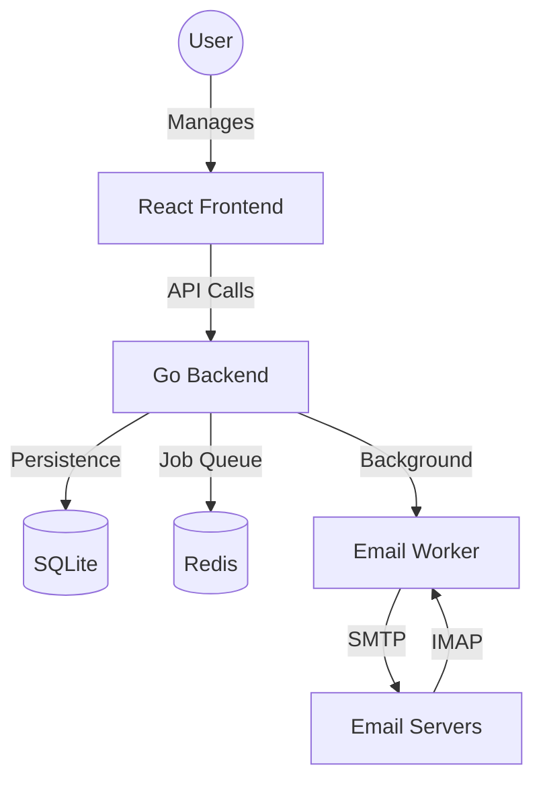

# AI Email Automation Agent

> **🚀 Enterprise-grade Autonomous Email Outreach System**

A 24/7 autonomous email outreach and monitoring system built with a high-concurrency **Go** backend and a modern **React + Vite** frontend. Designed for high-volume campaigns with dynamic templates, inbox rotation, and intelligent reply detection.

---

## 🏗️ Architecture Overview



---

## ✨ Features

- **⚡ High Performance**: Concurrent Go backend for efficient email processing.
- **🔄 Inbox Rotation**: Distribute outgoing mail across multiple SMTP accounts to avoid rate limits.
- **📈 Real-time Analytics**: Monitor campaign progress, open rates, and replies dynamically.
- **🧠 Reply Detection**: Automatically stop follow-up sequences when a lead replies via IMAP monitoring.
- **📜 Templating Engine**: Dynamic CSV ingestion with variables for highly personalized outreach.
- **📅 State Machine**: Multi-step follow-up sequences with customizable delays.

---

## 🛠️ Tech Stack

### Backend
- **Core**: Go 1.26+
- **API Framework**: [Echo](https://echo.labstack.com/)
- **Database**: SQLite (WAL Mode) with Gorm ORM
- **Cache/Queue**: Redis
- **Mailing**: SMTP for sending, IMAP for reply monitoring

### Frontend
- **Core**: React 19 + TypeScript + Vite
- **Routing**: TanStack Router
- **Data Fetching**: TanStack Query
- **State Management**: Zustand
- **Styling**: Tailwind CSS 4.0

---

## 📁 Project Structure

```text
.
├── email-agent-backend/   # Go 1.26+ REST API & background worker
│   ├── cmd/               # Entry points (API & Workers)
│   └── internal/          # Core business logic
├── email-agent-frontend/  # React + Vite dashboard
│   ├── src/features/      # Domain-specific components & logic
│   └── src/lib/           # Shared utilities & configurations
└── docker-compose.yml     # Container orchestration
```

---

## 🚀 Getting Started

### Prerequisites

- [Docker](https://www.docker.com/) & Docker Compose
- Node.js 18+ (for local development)
- Go 1.26+ (for local development)

### Quick Start (Docker)

```bash
docker-compose up --build
```
The dashboard will be available at `http://localhost:5173` and the API at `http://localhost:8080`.

### Local Development

Refer to the individual READMEs for detailed setup instructions:
- [Backend Documentation](file:///mnt/Sriyush/codes/email-agent/email-agent-backend/README.md)
- [Frontend Documentation](file:///mnt/Sriyush/codes/email-agent/email-agent-frontend/README.md)

---

## 📜 License

[MIT License](LICENSE)
